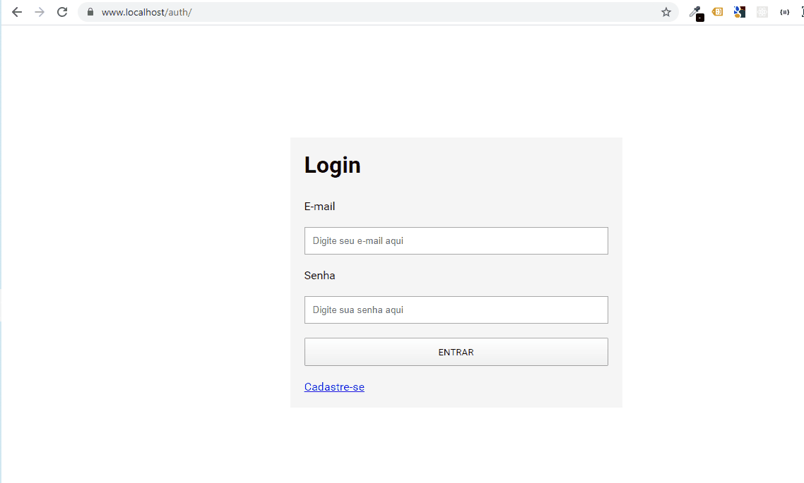

# Login

Login com PHP

## Início

Login com PHP em estrutura MVC, sem o uso de frameworks back-end, somente utilizando componentes externos para as rotas, views e o data Layer. Componentes:
- coffeecode/router
- coffeecode/datalayer
- league/plates

### Pré-requisitos

- Ambiente local instalado;
- Composer instalado;
- Rodar o comando ```composer update```;
- Importar a base de dados, incluída aqui mesmo no repositório (auth_php.sql)



## Autores

* **Cristian Kozlowski**

## Licença

MIT
